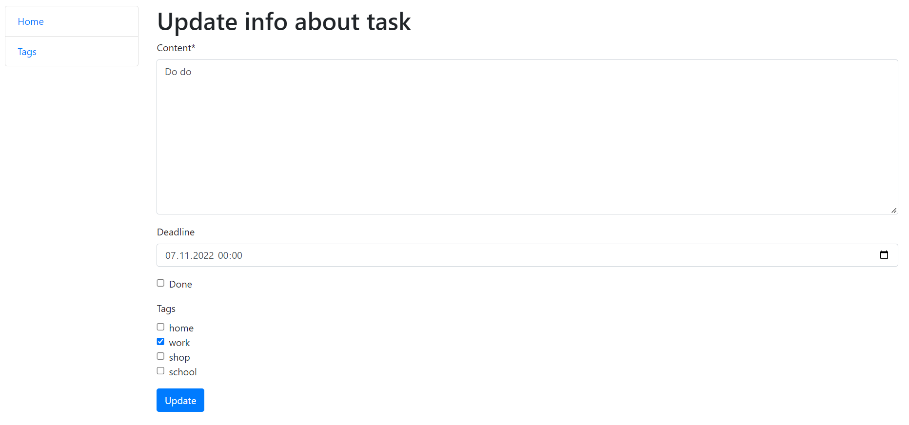
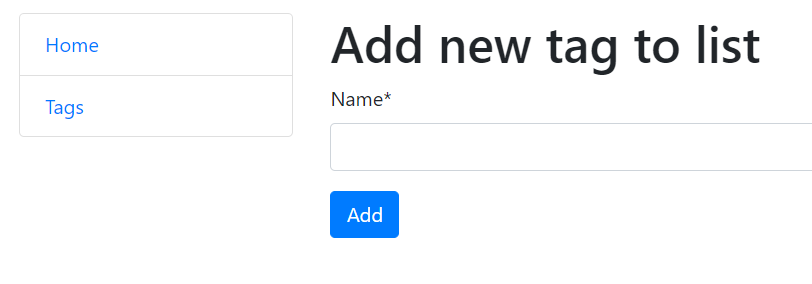
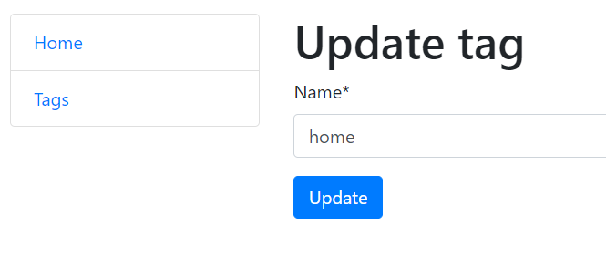

# TODO List manager

Django project for managing tasks with TODO List

## Installation

Python3 must be already installed

```shell
git clone https://github.com/Hectorovich/todo-list/tree/dev
cd todo-list
python -m venv venv
venv/scripts/activate
pip install -r requirements.txt
python manage.py runserver  # start Django project
```

## Features

* Managing tasks using interface of TODO LIst app
* Possibility create tags and add them to any task
* Powerful admin panel for advanced managing

## Demo







